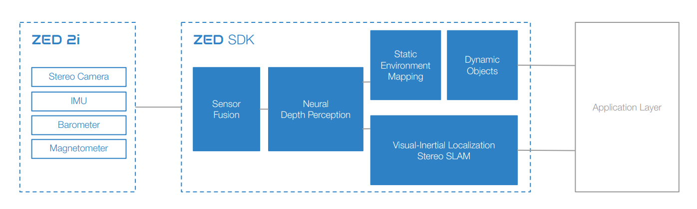
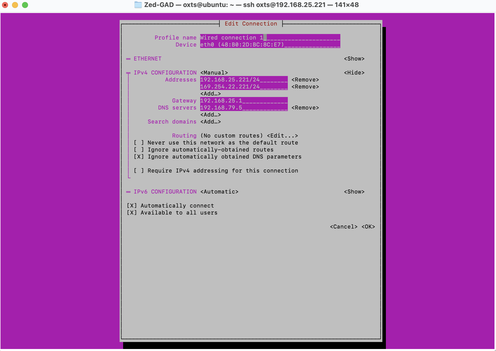
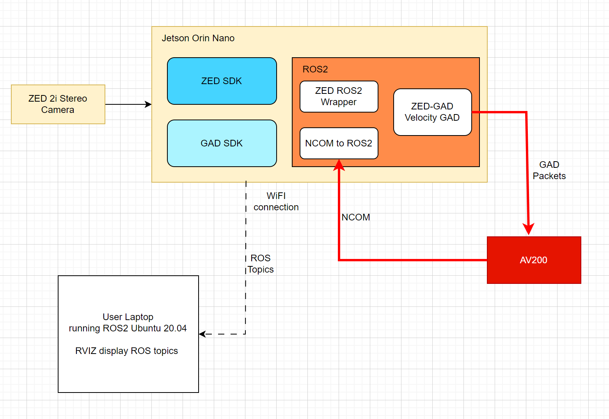

# Zed-GAD

AV200 accepts Generic Aiding Data [GAD](https://oxfordtechnicalsolutions.github.io/index.html)
from sensors such as Camera odometry data and able to provide navigation data in a global co-ordinate Latitude, 
Longitude and Altitude frame. Documentation below discusses how to achieve a GAD system running successfully.

ZED 2i Camera and AV200 supports ROS2 frameworks. ZED 2i Stereo Camera provides Visual Odometry (VO) topics with ROS2. 
AV200 supports Generic Aiding Data GAD for localisation in a GNSS denied environment. Motivation for the project is to use the 
ZED camera visual odometry data as Velocity GAD and send it to the AV200 as GAD packets and allow the AV200 to provide navigation 
odometry as ROS2 topics. Rviz allows to visualise the ROS2 topics to validate the data. 

Follow the steps in a chronological order as discussed below to install the required software, build example code, configure the 
system and run the application in ROS2 environment.

# Required Hardware:

•	AV200 with Velocity GAD feature enabled. To enable the feature code please contact OxTS support team.<br>
•	ZED 2i camera.<br>
•	Jetson Orin Nano.<br>

# Installation
Directory structure must be followed in order for a successful installation.

ROS2 Working folder:

**~/projects/ros_ws/**

ROS2 Work Space folder:

**~/projects/ros_ws/**  colcon build should be done from this folder.

ROS2 packages folder:

**~/projects/ros_ws/src/**   clone all ROS2 wrapper and packages from this folder.

Follow the installation steps as discussed below:


Jetson Orin Nano does not have preinstalled operating system. [Jetpack](https://docs.nvidia.com/jetson/jetpack/introduction/index.html) 5.1.1 required for ZED SDK. If you have Jetson Orin Nano with preinstalled Jetpack 5.1.1 please skip the step 1 and check for the
installed versions.

## 1)	Jetson Orin Nano Jetpack 5.1.1

Run NVIDIA [sdkmanager](https://developer.nvidia.com/sdk-manager) on a Ubuntu 20.04 laptop or desktop computer. User login required to download the sdk manager. The Jetson Orin must have the micro sd card inserted with usb-c connected to the Ubuntu 20.04 laptop/desktop and powered on. Launch the sdk manager using command line **sdkmanager** and it will detect the
Jetson Orin Nano automatically. Select the target and Jetpack 5.1.1 as its required by the ZED SDK. 

Once sdkmanager have finished installation Jetpack image on to Jetson Orin Nano unplug the usb-c connector and hard reboot the Jetson Orin Nano.

<image src="./images/JetsonOrin.png" width="800">

Run the following command to check for correct version of the Ubuntu, CUDA, OpenCV installed.

- Jetpack version<br>
```
sudo apt-cache show nvidia-jetpack
```
- CUDA version<br>
```
nvcc --version
```
- Ubuntu version<br>
```
lsb_release -a
```
- OpenCV version<br>
```
dpkg -l | grep libopencv
```
Once the necessary software are installed its necessary to create the folder name **project**, cloning git repos must be done within **project** folder.<br>

## 2)	ZED SDK

Follow the [link](https://www.stereolabs.com/developers/release/) download the ZED SDK JetPack 5.1.1 (L4T 35.3) and follow the [instructions](https://www.stereolabs.com/docs/installation/jetson/).<br>

The ZED SDK file ./ZED_SDK_Tegra_L4T35.3_v4.0.6.zstd.run will be downloaded in Download folder and run for installation and it may require 2 hours to install. Once installation completed go to folder /usr/local/zed/tools and the ZED_Diagnostic. The diagnostic application helps to indentify if there are any hardware issues.



## 3)   ZED-GAD

Make sure current working folder is **project**. Clone the [ZED-GAD](https://github.com/BazKhondkar-design/Zed-GAD.git).<br>
And it will have a sub folder called ZED-GAD. Sub folders:<br>

Build Scripts:<br>

zed_gad_node_build.sh -> This will build the ZED node.<br>

build_gad_sdk.sh      -> This will clone the GAD SDK repo, build and install the gad sdk.<br>

build_ncom_ros.sh     -> This will clone the NCOM ROS2 driver repo, build and install it.<br>

Run Scripts:<br>

zed_gad_node_run.sh   -> This will run the ZED node.<br>

Src: 

zed_gad.cpp     -> source file to implement the zed_gad ros node<br>

The call back Function *void ZedGadPoseOdom::odomCameraCallback(const nav_msgs::msg::Odometry::SharedPtr msg)* 
receives ZED camera odometry pose data, it contain the orientation in Quaternion and Position of the camera. The
position of the camera is in global frame and not in camera body frame. The camera orientation (yaw, pitch and roll) 
has been used to convert global position into body frame. The camera does not provide the velocity odometry. We have used
the time difference delta time between the frame and delta position to compute the velocity.

# Camera position global frame into body frame

```
double oriX = msg->pose.pose.orientation.x;
double oriY = msg->pose.pose.orientation.y;
double oriZ = msg->pose.pose.orientation.z;
double oriW = msg->pose.pose.orientation.w;
```

Converts the camera pose orientation into camera heading (yaw), pitch and roll angles using the *tf2::Quaternion* and *tf2::Matrix*.

```
tf2::Quaternion q(oriX, oriY, oriZ, oriW);
tf2::Matrix3x3 m(q);

double roll, pitch, yaw;       //in radian
m.getRPY(roll, pitch, yaw);
```

Convert angles to matrices
```
Eigen::Matrix<double, 3, 3> Rh, Rp, Rr;
```

Heading rotation matrix<br>
```

Rh <<  cos(yaw),        -sin(yaw),        0,
       sin(yaw),        cos(yaw),         0,
       0,               0,                1;

```
Pitch rotation matrix<br>
```

Rp <<   cos(pitch),      0,                sin(pitch),
        0,               1,                0,
        -sin(pitch),     0,                cos(pitch);

```
Roll rotation matrix
```

Rr <<  1.0,             0.0,              0,
        0,               cos(roll),       -sin(roll),
        0,               sin(roll),       cos(roll);

```

// Apply all rotations as discussed [here](https://support.oxts.com/hc/en-us/articles/115002859149-OxTS-Reference-Frames-and-ISO8855-Reference-Frames#C3).

```

Eigen::Matrix<double, 3, 3> C_lc = Rh * Rp * Rr;
Eigen::Matrix<double, 3, 3> C_cl = C_lc.transpose();

```

# Convert position between two frame into velocity Vx, Vy, Vz

Compute velocities in the global frame
*m_prevX m_prevY and m_prevZ* are the previous global position. *time_delta* is the time difference between the previous and current frame.

```

double x_diff = msg->pose.pose.position.x - m_prevX;
double y_diff = msg->pose.pose.position.y - m_prevY;
double z_diff = msg->pose.pose.position.z - m_prevZ;

double velX = time_delta != 0 ? x_diff / time_delta : 0;
double velY = time_delta != 0 ? y_diff / time_delta : 0;
double velZ = time_delta != 0 ? z_diff / time_delta : 0;

```

# Create GAD packets

```
OxTS::GadVelocity gv = OxTS::GadVelocity(130); //Gad packet ID 130 will be sent to the AV200
gv.SetVelOdom(Vx, Vy, Vz);
```

The covariance matrix of the camera pose odometry is a 6 by 6 matrix has a total of 36 elements
we use the diagnoal elements of the matrix element 0 7 and 14, 3 covarnace values required to 
create the GAD packet.

```
double covarXX = msg->pose.covariance[0];
double covarYY = msg->pose.covariance[7];
double covarZZ = msg->pose.covariance[14];
gv.SetVelOdomVar(fabs(covarXX), fabs(covarYY), fabs(covarZZ));
```
Set the gad packet in latency mode
```
gv.SetTimeVoid();

m_gh.SendPacket(gv);
```

zed_gad.h       -> header file to declare the class function etc
main.cpp        -> runs the ros2 gad_zed node

# Executable:<br>

Use the av200_monitor to initialise the AV200. It will send the following commands based on the av200 navigation status:

*!set time target <weeks> <seconds> \r\n* AV200 Nav mode 1 will require system time

Once AV200 in Nav mode 2 it will send out the following commands:
*!set init aidpos <lat> <lon> <alt> \r\n*

*!set init hea <value> <accuracy> \r\n*

*!set init aidvel 0 0 0 \r\n*

Arguments required for av200_monitor

av200_monitor <ip_address> <lat> <lon> <alt> <heading_deg> <heading_accuracy>

## 3)	GAD SDK

Make sure current folder is **projects** folder.

### Install script

sudo .\zed-gad\script\build_gad_sdk

### install manually

Require Boost 1.7 to build GAD SDK
    - Follow the [link](https://github.com/OxfordTechnicalSolutions/gad-sdk) to install Boost 1.7.<br>
    - Jetson Orin Nano supports the following command:<br>
    ```
       sudo apt-get install cmake
       sudo apt-get install libboost-all-dev
    ```

```
git clone https://github.com/OxfordTechnicalSolutions/gad-sdk.git --recursive
cd gad-sdk
mkdir build && cd build
cmake ..
sudo cmake --build . --target install
``` 

## 4)   Install ROS2 Foxy

ROS2 [Foxy](https://www.stereolabs.com/blog/getting-started-with-ros2-on-jetson-agx-orin/) follow the instructions to install the Foxy. Also it contains
the instructions to install the ZED ROS2 Wrapper. The ZED ROS2 wrapper needs to be build using the colcon build command. Prior to running the command 
colcon build it will necessary to clone the following ROS2 packages as its not installed by the Foxy. Make sure the current folder is **~/projects/ros_ws/src/**

- [nmea_msg](https://github.com/ros-drivers/nmea_msgs) ROS2 package required by ZED ROS2 wrapper to build.
Clone the repository **~/projects/ros_ws/src/** and once the repository is cloned, checkout the branch ros2.

- [geographic_info](https://github.com/ros-geographic-info/geographic_info.git) ROS2 package required by ZED ROS2
wrapper to build. Clone the repository **~/projects/ros_ws/src/** and once the repository is cloned, checkout the
branch ros2.

- [diagnoistic](https://github.com/ros/diagnostics.git) ROS2 package required by ZED ROS2 wrapper to build. Clone the repository **~/projects/ros_ws/src/** and once the repository is cloned, checkout the branch ros2.

- sudo apt install ros-foxy-robot-localization. The robot_localization package required by the ZED ROS2 wrapper to
build.

- Clone zed-ros2-wrapper. git clone  --recursive https://github.com/stereolabs/zed-ros2-wrapper.git && \
    git clone https://github.com/ros-perception/image_common.git --branch 3.0.0 --single-branch

``` sudo apt-get install ros-foxy-xacro``` 

Once the above packages are cloned change current directory to ~/projects/ros_ws/ to build the packages.

``` source /opt/ros/foxy/setup.bash``` 
``` colcon build --symlink-install --cmake-args -DCMAKE_LIBRARY_PATH=/usr/local/cuda/lib64/stubs -DCMAKE_CXX_FLAGS="-Wl,--allow-shlib-undefined" ``` 

## 5)	NCOM ROS2 Driver

Make sure you are in **project** folder.

### Install script

sudo .\zed-gad\script\build_ncom_ros.sh

### install manually

Follow the instructions to build the OxTS ROS2 [driver](https://github.com/OxfordTechnicalSolutions/oxts_ros2_driver). Clone the repo within
**project** folder.

## 6)	System Configuration

Jetson Orin Nano needs to be configured with WIFI hotspot to allow the user laptop to receive ROS data. 
[jetsonhacks.com](https://jetsonhacks.com/2021/10/05/wi-fi-hotspot-setup-nvidia-jetson-developer-kits/) 
shows how to setup the HotSpot on Jetson Orin Nano.

# Resolve subnet issues 

If the AV200 ip address and Jetson Orin Nano ip address are not on the same subnet, it does not allow to send command to the INS using the *av200_monitor*. In order to over come the issue use **nmtui** command add the subnet of the AV200 ip address.



The Jetson Orin Nano has the ip address 192.168.25.221 and AV200 has the ip address 169.254.22.110. Add ip address 
169.254.22.221 so that Jetson Orin can send command and ftp files from the unit.

# ZED canera and AV200 setup for PTP (Precision Time Protocol) using GNSS

ZED camera support [PTP](https://www.stereolabs.com/docs/video/multi-camera/) setup and AV200 configured with GNSS as the master for PTP.
Install the PTP on Jetson Orin using the following [link](https://tsn.readthedocs.io/timesync.html), its best to clone it within project folder
follow the command to build and install.

Use NAVconfig to configure the AV200 as PTP master. Disable the Automatic Date & Time update over internet on Jetson Orin.

Edit the gPTP.cfg file and network_transport should be set to UDPv4.

On the Jetson Orin run the folowing command:

```
sudo ptp4l -i eth0 -f configs/gPTP.cfg --step_threshold=1 -m -S -s
```

The PTP configs is in the timesync folder and make sure you are in the correct folder.

## AV200 mobile.cfg configuration without GNSS
```
-x>gps1: b5 62 06 8a 14 00 00 01 00 00 05 00 05 40 00 00 00 00 04 00 05 40 e8 03 00 00 23 be
-time_sync_int # Allow AV200 to receive time using command, AV200 does not have GNSS connected and would require external time
-gad_on130  ### Set the GAD packet ON ###
-location3_0.08_0.04_0.01_0.05_0.05_0.05 # position of the camera with respect to AV200 IMU
-attitude5_0.0_0.0_180.0_0.10_0.10_0.10 # roll rotation required for the AV200 in the same frame as the Camera
-gad_loc_id130_3
-gad_att_id130_5
-sync_mode_xoemcore # GPS card to generate PPS
```
## 7)   System Architecture



Above system was mounted on Jackal for demonstration.

## 8)   Co-ordinate translation

Camera odom topic on ROS2 has a right hand co-ordinate frame.<br>

X is Forward<br> 
Y is Left<br>
Z is Up<br> 

AV200 co-ordinate<br>

X is Forward<br>
Y is Right<br>
Z is Down<br>

<image src="./images/co-ordinate.png" width="800">

## 9)   Data Visualisation and setup validation:

Once the AV200 is initialised using the av200_monitor. Run */opt/ros/foxy/setup.bash* and *. install/setup.bash* from
the folder *~/projects/ros_ws.*
And launch the zed_node and zed_gad node using this the launch command discussed below. 

Display the nodes are running using the command:

```
ros2 node list 
```

Display the topics are running using the command:

```
ros2 topic list 
```

Display the rviz using the command:

```
rviz2
```

## 10) Zed Camera Gad validation:

Install rqt visual tool for plotting velocity topic provided by the zed_gad node.

```
sudo apt-get install ros-foxy-rqt
sudo apt-get install ros-foxy-common-plugins

```

run *rqt* on command line to view the ZED camera body velocity. Also make sure the /zed2i/zed_node node and zed_gad nodes are running.

Move the camera forward/backward and Velocity Vx should change.
Move the camera left/right and Velocity Vy should change.
Move the camera up/down and Velocity Vz should change.

Change the heading of the Camera from its origin state i.e. rotate by 90 deg and repeat the above process.
Change in velocity should correspond to the camera body frame.

## RUN zed_gad node to send Velocity GAD

```
ros2 run zed_gad zed_gad <AV200 IP Address>
```

## Sending command to AV200

Use the ubuntu NetCat command to send udp packet on port 3001 for AV200.

*nc -u <AV200_IP_Address> 3001*

!Reset 

!set init aidpos <lat> <lon> <alt>

!set init hea <value> <accuracy>

!set init aidvel <Vx> <Vy> <Vz>

Above list of command can be used to send command using the *nc*.


# Launch
After plugging in the ZED 2i camera, run the ZED Diagnostic tool to ensure system requirements have been met and configure the camera.

Launch the ZED node to begin publishing topics from the ZED wrapper.

```
ros2 launch zed_wrapper zed2i.launch.py
```

Run the zed_gad node to send Velocity GAD packets and publish velocity.

```
ros2 run zed_gad zed_gad <AV200 IP Address>
```

Edit the ~/projects/ros_ws/src/oxts_ros2_driver/oxts_driver/config/default.yaml and change the unit_ip address with the ip address
of the AV200.

Run the command to publish the NCOM odom topic

```
ros2 launch oxts run.py unit_pi:=<IP_Address> lrf_source:=0
```

# ZED camera perfromance using GAD

<image src="./images/ZedCameraPerfromance.png" width="800">

Green represent ground using GNSS truth and red represent Camera ZED-GAD.
